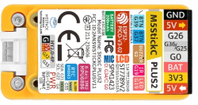
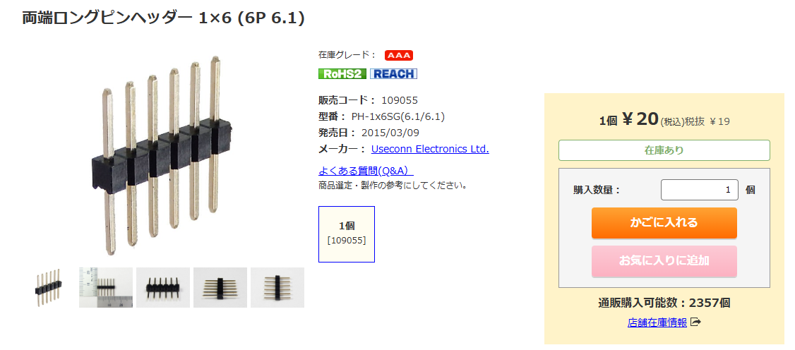

# サーボテスト (M5StickC Plus2)

###  ■ご利用にあたって
* ホームネットワークのWifi環境を必要とします。
* VSCodeにPlatformIO環境を想定しています。<br>
※Arduino-IDEでのビルドにはファイルのアレンジが必要になります。

###  ■準備
* include/ssid.h_の名前を変更します。末尾の(_)アンダーバーを削除してください。
* include/ssid.hにホームネットワークのSSIDとパスキーを記載します。
```
include/ssid.h
#define SSID_NAME  "***************"
#define SSID_KEY   "***************"
``` 
* data配下のファイルをLittleFSにアップロードします。<br>
  [PlatformIO]-[Upload Filesystem image]

###  ■テスト方法
* M5StickCPlus2にサーボを接続<br>
  
```
                 < 接続方法 >
                GND --+-- GND
  M5StickCPlus2 5V  --+-- VCC   Servo(SG90)
                G26 --+-- S
  ```
* 両端ロングピンヘッダー
  
  https://akizukidenshi.com/catalog/g/g109055/

1. USBケーブルを挿入すると起動します。<br>
  ※バッテリー動作の場合はＣ(左下)ボタンを２秒以上押下します。
2. 画面に表示されるIPアドレスにブラウザから接続します。
3. スライダーを左右に移動するとサーボモーターが動作します。
4. 終了したらＡ(正面下)ボタンを押して終了します。
5. Ｂ(右上)ボタンの押下によりリセットされます。